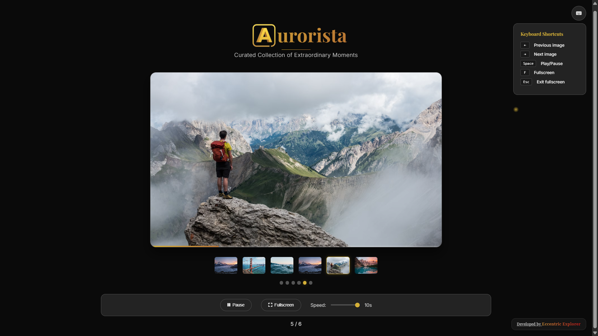

<div align="center"></div>

# <div align="center">AURORISTA</div>

**Aurorista** is a premium, interactive image slider and gallery designed to showcase captivating visuals with an elegant and intuitive user interface. It combines smooth animations, responsive design, and robust controls to deliver an exceptional Browse experience.

---

## 🚀 Live Demo

Experience Aurorista live here: 
👉 [](https://eccentriccoder01.github.io/Aurorista)

 <div align="center">
 <p>

[](https://github.com/ellerbrock/open-source-badges/)


 </p>
 </div>

## 📸 Screenshots

<div align="center"></div>

---

### 💡 Core Features (Image Gallery & Controls)

* **Image Display**: Seamlessly displays high-quality images with titles and descriptions.
* **Navigation**:
    * **Previous/Next Buttons**: Intuitive controls to move between images.
    * **Thumbnails**: A visual array of small image previews allowing direct access to any slide.
    * **Slide Indicators**: Dot indicators that show the current slide position and allow direct navigation.
    * **Keyboard Navigation**: Navigate using `ArrowLeft` and `ArrowRight` keys.
    * **Mouse Wheel Navigation**: Scroll up/down to navigate through images.
    * **Touch/Swipe Navigation**: Swipe left or right on touch-enabled devices to change slides.
* **Auto-play**: Automatically advances through slides after a set duration.
* **Play/Pause Control**: Manually start or stop the auto-play functionality.
* **Adjustable Auto-play Speed**: Users can customize the auto-play speed from 1 to 10 seconds.
* **Progress Bar**: A visual progress bar indicates the time remaining until the next slide transition during auto-play.
* **Image Counter**: Displays the current image number relative to the total number of images (e.g., "1 / 5").

### 💡 User Interface & Experience

Aurorista provides a visually rich and responsive user interface:

* **Immersive Design**: The overall design is geared towards creating an immersive space-themed experience with celestial backgrounds and vibrant gradient accents.
* **Responsive Layout**: The application's layout adapts seamlessly to various screen sizes, ensuring optimal viewing and interaction on desktops, tablets, and mobile devices.
* **Intuitive Navigation**: Clear buttons and interactive elements guide the user through the gallery.
* **Dynamic Animations**: Smooth transitions, counter animations, and visual feedback (like the rocket launch) enhance user engagement.
* **Clear Information Hierarchy**: Content is logically organized into distinct sections, making it easy for users to find information.

---

## 🛠️ Technology Stack

Aurorista is built using a standard web development stack, focusing on client-side technologies for a rich interactive experience.


---

## ⚙️ Setup Instructions

To run Aurorista:

### 1. Clone the Repository

```bash
git clone [https://github.com/eccentriccoder01/Aurorista.git](https://github.com/eccentriccoder01/Aurorista.git)
cd Aurorista
````

### 2\. Install Dependencies

Each folder (`js`, `styles`, `favicon`, etc.) is client-side. You can serve the project using any local server (e.g. `Live Server` in VSCode or Python's HTTP server):

```bash
npx live-server .
```
-----

## 🚧 Roadmap & Future Enhancements

  * [ ] Integrate more diverse image sources and categories.
  * [ ] Add options for user-defined image collections.
  * [ ] Implement more interactive image manipulation features (e.g., zoom, pan).
  * [ ] Develop additional transition effects for image changes.
  * [ ] Introduce social sharing functionalities for images.

---

## Issue Creation ✴

Report bugs and issues or propose improvements through our GitHub repository's "Issues" tab.

## Contribution Guidelines 📑

- Firstly Star(⭐) the Repository
- Fork the Repository and create a new branch for any updates/changes/issue you are working on.
- Start Coding and do changes.
- Commit your changes
- Create a Pull Request which will be reviewed and suggestions would be added to improve it.
- Add Screenshots and updated website links to help us understand what changes is all about.

- Check the [CONTRIBUTING.md](CONTRIBUTING.md) for detailed steps...

## Contributing is fun🧡

We welcome all contributions and suggestions!
Whether it's a new feature, design improvement, or a bug fix - your voice matters 💜

Your insights are invaluable to us. Reach out to us team for any inquiries, feedback, or concerns.

## 📄 License

This project is open-source and available under the MIT License.

## 📞 Contact

Developed by [Eccentric Explorer](https://eccentriccoder01.github.io/Me)

Feel free to reach out with any questions or feedback\!